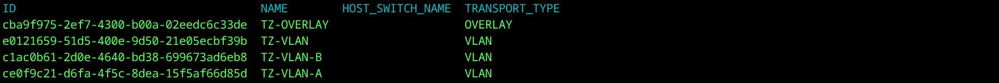
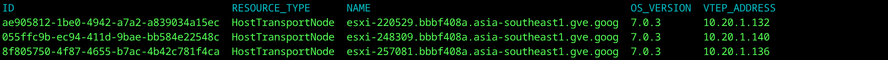
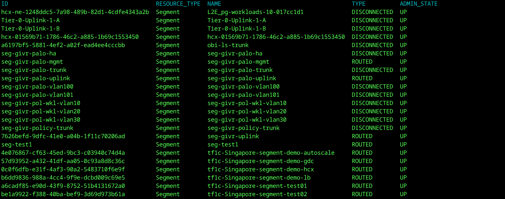
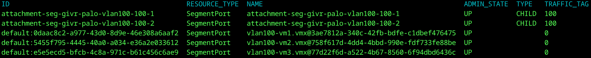
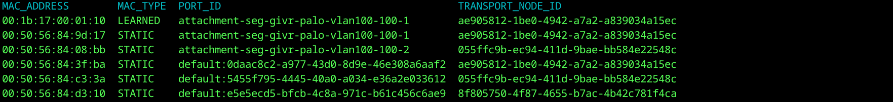

#### 1: Ensure you have JQ and CURL installed
Ensure you meet the pre-requisites on linux to execute to scripts.
Currently, these have been tested on Centos.

##### Rocky / RHEL / Fedora
```shell
dnf install -y curl jq
```

##### Ubuntu
```shell
apt install -y curl jq
```

##### Mac OSX
Install brew
```shell
ruby -e "$(curl -fsSL https://raw.githubusercontent.com/Homebrew/install/master/install)" </dev/null 2>/dev/null
```

Install curl + jq
```shell
brew install curl jq
```

#### 2: Clone repository from GitHub
Perform the following command to download the CLI scripts - this will create a directory `nsx` on your local machine
```shell
git clone https://github.com/apnex/nsx
```

#### 3: Navigate to `/policy` for latest api commands
```shell
cd nsx/policy
```

#### 4: Set up sddc endpoints and parameters
Modify the `drv/sddc.parameters` file to reflect the parameters for your lab accordingly.  
The `dns` field will be used to verify forward and reverse dns entries for each endpoint.  
The `domain` property is currently unused - please provide FQDN for `hostname`.  
For NSX Manager operations, the **vsp** endpoint is optional and not required.  
```json
{
	"dns": "172.16.0.1",
	"domain": "lab",
	"endpoints": [
		{
			"type": "nsx",
			"hostname": "nsxm01.fqdn.name",
			"username": "admin",
			"password": "VMware1!VMware1!",
			"online": "true"
		},
		{
			"type": "vsp",
			"hostname": "vcenter.fqdn.name",
			"username": "administrator@vsphere.local",
			"password": "VMware1!",
			"online": "true"
		}
	]
}
```

---
### CLI Operation
Included are a series of cmdlets written entire in `bash`, with only a dependency on `jq` and `curl`.  
You can execute any single cmdlet directly in linux shell to make the specified API call to the NSX Policy API.  

Note: Each `cmd.<request>.sh` links to a driver in the `drv` directory.  
Should you require "raw" API response body (and not a table) you can run these directly.  

#### Quiet
Commands display an api request log to `stderr` to allow you to filter these out to `/dev/null`.  
Removing shell logs from `cmd.transport-zones.list.sh` for example:  
```shell
./cmd.transport-zones.list.sh 2>/dev/null
```

#### Filter
Any command can be combined with standard shell tooling for filtering output.  
For example using `grep` to filter for a specific `transport-zone`:  
```shell
./cmd.transport-zones.list.sh | grep TZ-OVERLAY
```

#### Watch
`watch` can also be used to "live monitor" an API response from a command.  
This can be combined with removing `stderr` for neat output.  
For example, you may wish to `watch` the "live" `mac-table` of a `segment` as follows;  
```shell
watch -cn 3 "./cmd.segments.mac-table.list.sh seg-givr-palo-vlan100 2>/dev/null"
```

This will show the `mac-table` output and `watch` (with colours enabled) on a 3-second interval.  

---
### CLI Reference
Included cmdlets are as follows:  

#### <b>cmd.transport-zones.list.sh</b>
```shell
./cmd.transport-zones.list.sh
```

### CLI CMD Examples
The following examples show use of some of the CLI commands included against the policy api.  

#### <b>cmd.transport-zones.list.sh</b>
```shell
./cmd.transport-zones.list.sh
```



This command lists available transport zones  

#### <b>cmd.transport-nodes.list.sh</b>
```shell
./cmd.transport-nodes.list.sh
```



This command lists available transport nodes  

#### <b>cmd.segments.list.sh</b>
```shell
./cmd.segments.list.sh
```



This command lists configured segments  

#### <b>cmd.segments.ports.list.sh</b> {<b>segment.id</b>}
```shell
./cmd.segments.ports.list.sh seg-givr-palo-vlan100
```



This command lists ports within a specified segment

#### <b>cmd.segments.mac-table.list.sh</b> {<b>segment.id</b>}
```shell
./cmd.segments.mac-table.list.sh seg-givr-palo-vlan100
```



This command lists the mac-table for an entire segment spanning multiple nodes
